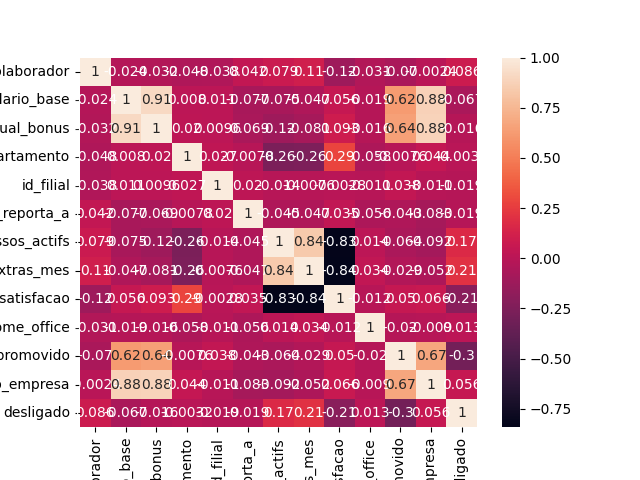

# ⚖️ Desafio de Nivelamento LACEDA 2026 - Eixo de Ciência e Engenharia de Dados

## 1. Contexto

O departamento de Recursos Humanos de um grande escritório de advocacia forneceu bases de dados (`dados/funcionarios.csv`, `dados/filiais.csv` e `dados/departamentos.csv`) com informações dos colaboradores. O objetivo desta análise é atuar como cientista/engenheiro(a) de dados para identificar os principais fatores associados ao desligamento (evasão) dos colaboradores e apresentar as conclusões em forma de insights e dashboards.

A principal base utilizada (`funcionarios.csv`) contém 650 colaboradores e 16 colunas, incluindo dados pessoais (nome, gênero), de carreira (nível, data de admissão, data de promoção), financeiros (salário-base, percentual de bônus) e operacionais (departamento, filial, gestor, processos ativos, horas extras, score de satisfação, home office, status atual).

## 2. Premissas adotadas
* A coluna `status_atual` foi tratada como variável-alvo (`desligado` = 1 para "Desligado", 0 para "Ativo").
* A coluna `genero` tinha uma inconsistência de rótulo ("Fem" em algumas linhas, "Feminino" em outras) e ambas foram tratadas como a mesma categoria.
* `data_promocao` nula foi interpretada como ausência de promoção desde o dia da admissão, e não como dado ausente por erro, dando origem à coluna `ja_promovido`.

## 3. Metodologia
A análise seguiu uma abordagem exploratória: estatísticas descritivas gerais, cálculo da taxa de desligamento cruzada com variáveis categóricas e numéricas, e verificação de correlação entre as variáveis numéricas e o desligamento via matriz de correlação (heatmap).

## 4. Principais achados

### 4.1 Taxa geral de desligamento
A taxa geral de desligamento na base é de 27,2% (177 de 650 colaboradores).

### 4.2 Promoção como fator de retenção
Colaboradores que já foram promovidos têm uma taxa de desligamento bem menor do que os que nunca foram promovidos, o que indica que a promoção (ou a falta dela) pode ser um fator relevante de retenção.

%20por%20status%20de%20promocao.png)

### 4.3 Satisfação por departamento
O departamento 20 apresenta, em média, a menor satisfação entre os departamentos.

%20por%20departamento.png)

### 4.4 Desligamento por departamento
O departamento 20 também apresenta a maior taxa de desligamento entre os quatro departamentos, o que é consistente com sua menor satisfação média — dado que a correlação entre satisfação e desligamento é negativa (gráfico da seção 4.5).

%20por%20departamento.png)

### 4.5 Satisfação x desligamento
A matriz de correlação mostra uma relação negativa (ainda que fraca) entre score_satisfacao e desligado: quanto maior a satisfação, menor a chance de desligamento.

### 4.6 Departamento 20 apresenta carga de trabalho como causa de insatisfação

A taxa de promoção do departamento 20 é semelhante à dos demais departamentos, ou seja, sua maior taxa de desligamento não é explicada por promover menos gente. Em vez disso, o departamento 20 tem a maior média de horas extras entre os departamentos, o que se conecta ao volume de processos jurídicos sob responsabilidade de cada advogado: mais processos, mais horas extras.

%20por%20departamento.png)

Essa carga de trabalho mais alta é uma explicação plausível para a menor satisfação observada no departamento (seção 4.3), que por sua vez se relaciona à maior taxa de desligamento (seção 4.5).

## 5. Conclusão
Os dados sugerem que a evasão nesta empresa está mais associada à falta de progressão de carreira e à sobrecarga de trabalho do que a fatores como salário, gênero ou modelo de trabalho. Colaboradores nunca promovidos apresentam taxa de desligamento bem mais alta, um padrão que atinge a empresa como um todo.

Já o departamento 20 concentra um problema próprio: sua taxa de promoção é parecida com a dos demais, então a explicação não é falta de promoção. O que se destaca é uma carga de trabalho maior (mais horas extras, ligadas ao volume de processos por advogado), que aparenta reduzir a satisfação e, com isso, elevar o desligamento nesse departamento especificamente.

## 6. Recomendações
* Revisar os critérios e a frequência de promoção, onde a falta de progressão parece pesar mais na decisão de sair.
* Avaliar a distribuição de processos jurídicos por advogado no departamento 20, buscando reduzir a carga de horas extras nessa área.
* Acompanhar o score de satisfação como indicador de risco de saída, já que se mostrou correlacionado (ainda que fracamente) ao desligamento.

## 7. Limitações
* A base não possui data de desligamento, apenas de admissão, ou seja, não há informações sobre o tempo de empresa de quem já saiu.

## Autor(a)

Feito por Mariana Bispo.
